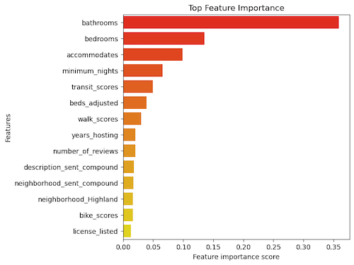
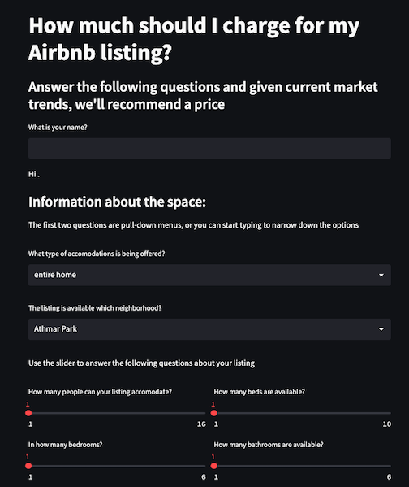

  

# Airbnb Price Recommender and Listing Analysis

### Carl Horwitz
---

## Table of Contents
1. [Background](#Background)
2. [Problem Statement](#Problem-Statement)
3. [Dataset Introduction](#Dataset-Introduction)
4. [Deliverables](#Deliverables)
5. [Executive Summary](#Executive-Summary)
6. [Recommended Next Steps](#Recommendations-and-Next-Steps)
7. [Data Dictionary](#Data-Dictionary)
8. [References](#References)

--- 
--- 

## Background

Airbnb is an online marketplace that allows people to rent out their properties or spare rooms to guests seeking accommodations. Over the years it has become a popular alternative to traditional hotels.  

Owners can list their properties on the Airbnb platform, set their own price, and manage their bookings through the site. Guests can search for properties based on location, price, and amenities, and can book their stays directly through the site. Airbnb offers a variety of accommodation options, ranging from private rooms in shared homes to entire houses. 

Airbnb is a nice way for owners to supplement their income, but is not free of criticism. The hospitality industry dislikes that it is taking guests away from existing hotels. In large metro areas where housing is at a premium, local residents argue these listings should be places for longer term renters. Like any consumer to consumer platfrom, there are also concerns over safety and regulation of properties.

--- 

## Problem Statement

The aim of this project was to create an aid to help those who list their property on Airbnb to get a better sense of how their listing compares to those around them. Given the space they have to offer, and the other listings available, how should they price their lisiting?  If they have reviews, how do they compare to the reviews of other listing?  How is the tone of their listing and reviews?  

The significance of this problem to help each owner optimize their listing so they have the best chance of getting somebody in their space at the right price point. In addition I have added a focus on natural language processing so owners can better understand the tone of their listing as well as the tone of the reviews they have received.  I focused my data to Denver, but this can easily be scaled to other metro areas as well.

--- 

## Dataset Introduction

In this project, I have ensembled multiple datasets to enhance my analysis. My primary datasets were downloaded from InsideAirbnb, a website that does quarterly scrapes of the Airbnb site.  Their data includes pretty much any/all listening information provided in an Airbnb post. Data is separated into major metropolitian areas. The dataset from Denver contained over 5250 listings, with 75 features to a home.  Another dataset from Airbnb contained all the reviews for the Denver listings. This contained over a quarter million individual reviews, with around 4000 of the listings having at least one review. The listings information did not include any addresses, but did include the neighborhood. I wanted to get more specific information about the home's location so I used the given latitude and longitude and the WalkScore API to gather information about how walkable, bikeable and accessible to public transit each location is. 

---
## Deliverables

1. README.md: provides instruction and overview of the project

2. Prepoccessing folder 
* `01. cleaning.ipynb`: First round of cleaning
* `02. API.ipynb`: Walk Score API pull
* `03. NLP_on_listing.ipynb`: Sentiment Analysis on description columns
* `04. Working_with_the_price.ipynb`: Cleaning up the price column. Created two datasets to work with all listings and a more affordable subset. 
* `05. review_sentiment_analysis.ipynb`: Analyzing the sentiment of reviews for each listing. 
* `06. EDA.ipynb`: EDA exploration
* `07. Review NLP EDA.ipynb`: EDA exploration of reviews

3. Price Predictor folder 
* `00. baseline_exploration_1500`: Finding baseline and intitial model testing.  
* `01. bagging_DT.ipynb`: Grid searching a bagged trees model
* `02. ET pipeline_with_features.ipynb`: Grid searching a extra trees model
* `03. gradient_boost_pipeline.ipynb`: Grid searching a gradient boost trees model
* `04. RF pipeline.ipynb`: Grid searching a random forest model
* `05. RF_log_pipeline.ipynb`: Grid searching a random forest with a log transfomation 
* `06. neural_network.ipynb`: Neural Network model
* `07. Bagged_GB_and_XG.ipynb`: Grid searching over other tree models
* `xx. baseline_exploration_450`: Finding baseline and intitial model testing if I wanted to utilize a more affordable subset of listings.

4. images- folder containing various imagines made throughout EDA and modeling. 

5. streamlit- folder housing the streamlit_app.py and its associated pages

6. Capstone Airbnb.pdf- Presentation, also found at https://docs.google.com/presentation/d/1V3CbshkcWHjXC8CQjYQ4bek8tl3sx8WBYoXbKefhphY/edit?usp=sharing

7. data- folder containing original and cleaned datasets

--- 

## Executive Summary

After collecting and cleaning data that was provided by Airbnb and other ouside resources (WalkScore API and Natural language processing) I ran a wide range of prelimiary ML models (Extra Trees, Nueral network, Random Forest, Gradient Boost...) to try to predict the price of a listing. I took the best peforming models and did further parameter adjustments to try to find the best model. I ended up settling on a Bagging Decision Tree Regressor that reduced the baseline Root Mean Square Error (RMSE) score of 133 down to 63.

 

I was able to include this information in a streamlit app where a user (new or exisiting) can input information about their rental and receive a price recommendation. Within the app existing users can also compared the number, and sentiment, of their reviews against the mean. Lastly users can enter their descriptive sections (About Me, Neighborhood, Property) for a sentiment analyses compared to other posts.  

---

### Recommendations and Next Steps

Further refinement of the model can be done.
1.  If I could incorporate occupancy data, I could incorporate a time element, only considering listings that have been rented recently (or weight listings given the time since their last rental)

2. Often weekends and holidays rentals are more expensive and this model doesn't account for that.

3. Lastly incorporating the "amenities" column would be beneficial to modeling.  Given how it is (not) organized, I didn't have time to sort through that.

--- 

### Data Dictionary

Most of the data was taken from Inside AirBnb, their data dictionary can be found here: https://docs.google.com/spreadsheets/d/1iWCNJcSutYqpULSQHlNyGInUvHg2BoUGoNRIGa6Szc4/edit#gid=1322284596

Feature Engineered columns include 

| Column Name                | Description                                               | Data Type |
|----------------------------|-----------------------------------------------------------|-----------|
| shared_status              | Groups of types of accomodations (shared, hotel...)       | string    |
| accomodation_group         | Bins of accomodation size                                 | string    |
| has_neighborhood_overview  | Is there a neighborhood description                       | int       |
| has_reviews                | Does the listing have any reviews.                        | int       |
| host_in_CO                 | Does the host live in Colorado                            | int       |
| host_lives_in_neighborhood | Does the host live in the same neighborhood as the lstin  | int       |
| has_host_about             | Does the listing have an about the host section.          |  int      |
| years_of_reviews           | How many years of reviews are there                       | int       |
| years_hosting              | How many years of hosting                                 | int       |
| min_stay_group	         | Binned minimal stay legnth                                | string    |
| max_stay_group             | Binned maximum stay lengthttps                            | integer   |
| 25*k                       | Binned price                                              | int       |
| name_sent_compound*        | Sentiment analysis, compound score on Name                | int       |
| name_sent_pos*             | Sentiment analysis, positive score on Name                | int       |
| name_sent_neg*             | Sentiment analysis, negative score on Name                | int       |
| name_sent_neu*             | Sentiment analysis, neutral score on Name                 | int       |

A similar sentimnt analysis was conduction on 
* About the host (host_sent_XXX)
* Property description (description_sent_XXX) 
* Neighborhood description (neighborhood_sent_XXX) 

--- 

### References

1. Airbnb:   https://www.airbnb.com/
2. SlidesGo: Presentation Template  
https://slidesgo.com/theme/home-infographics
3. Freepik: Presentation pictures 
https://www.freepik.com/
4. Inside Airbnb:  
http://insideairbnb.com/get-the-data/
5. WalkScore API:  
https://www.walkscore.com/professional/api.php
6. Katie Sylvia: for helping me navigate all sorts of struggles. 
7. Kate Skibo: starter code to loop through different models 
8. ChatGPT for trying to help me, but usually failing.
