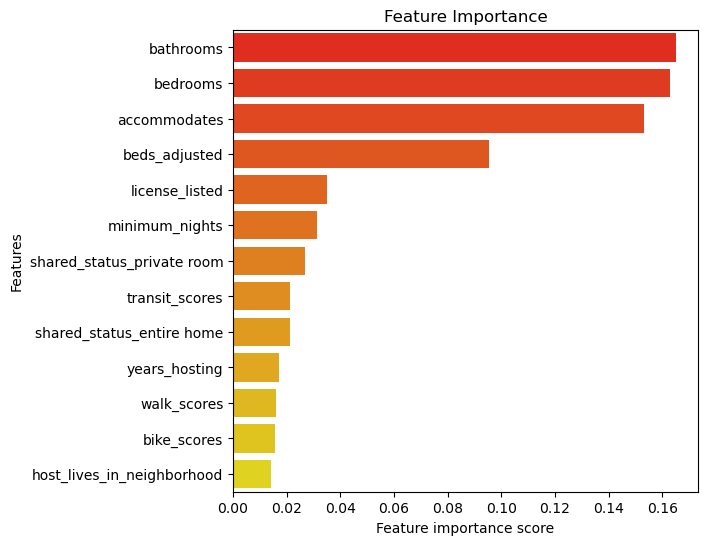

# Airbnb listing analysis

### Carl Horwitz
---

## Table of Contents
1. [Problem Statement](#Problem-Statement)
2. [Dataset Introduction](#Dataset-Introduction)
3. [My Notebooks](#My-Notebooks)
4. [Executive Summary](#Conclusions)
5. [Data Dictionary](#Data_Dictionary)
6. [Data](#Data)
7. [References](#References)

--- 
--- 

## Problem Statement

The aim of this project was to create an aid to help those who list their property on Airbnb to get a better sense of how their listing compares to those around them. Given the space they have to offer, and the other listings available, how should they price my lisiting?  If they have reviews, how do they compare to the reviews of other listing?  How is the tone of their listing and reviews?  

The significance of this problem to help each owner optimize their listing so they have the best chance of getting somebody in their space at the right price point. In addition I have added a focus on natural language processing so owners can better understand the tone of their listing as well as the tone of the reviews they have received.  I focused my data to Denver, but this can easily be scaled to other metro areas as well.

--- 

## Dataset Introduction

In this project, I have ensembled multiple datasets to enhance my analysis. My primary datasets were downloaded from InsideAirbnb, a website that does quarterly scrapes of the Airbnb site.  Their data includes pretty much any/all listening information provided in an Airbnb post. Data is separated into major metropolitian areas.  The dataset from Denver contained over 5250 listings, with 75 features to a home.  Another dataset from Airbnb contained all the reviews for the Denver listings. This contained over a quarter million individual reviews, with around4000 of the listings having at least one review. The listings information did not include any addresses, but did include the neighborhood. I wanted to get more specific information about the home's location so I used the given latitude and longitude and the Walk Score API to gather information about how walkable, bikeable and accessible to public transit each location is. 

---
## Deliverables

README.md: provides instruction and overview of the project

1. Prepoccessing Folder 
* `01. cleaning.ipynb`: First round of cleaning
* `02. api.ipynb`: Walk Score API pull
* `03. NLP_on_listing.ipynb`: Sentiment Analysis on description columns
* `04. Working_with_the_price.ipynb`: Cleaning up the price column
* `05.review_sentiment_analysis.ipynb`: Analyzing the sentiment of reviews for each listing. 
* `06. EDA.ipynb`: EDA exploration
2. Price Predictor Folder 
* `00. baseline_exploration`: Finding baseline and intitial model testing.  
* `01. bagging_pipelind.ipynb`: Grid searching a bagged trees model
* `02. ET pipeline.ipynb`: Grid searching a extra trees model
* `03. gradient_boost_pipeline.ipynb`: Grid searching a gradient boost trees model
* `04. RF pipeline.ipynb`: Grid searching a random forest model
* `05. RF_log_pipeline.ipynb`: Grid searching a random forest with a log transfomation 
* `06. neural_network.ipynb`: Neural Network model

3. images- Folder containing various imagines made throughout EDA and modeling. 

4. streamlit- folder housing the streamlit_app.py and its associated pages

5. presentation - pdf of the presentation, also found at 

--- 

## Executive Summary

Using the data that was provided by Airbnb and bringing in other ouside resources (WalkScore API and Natural language processing (NLP)) I was able to create a model that reduced an baseline Root Mean Square Error (RMSE) score of 133 down to 85. 

After running a wide range of ML models (Extra Trees, Nueral network, Random Forest, Gradient Boost, Bagged Trees...) I was able to settle an Extra Trees model that fairly accurately predicted the price of a rental property while taking into consideration the market. 

  

I was able to include this information in a streamlit app where a user (new or exisiting) can input information about their rental and receive a price recommendation. Within the app existing users can also compared the number, and sentiment, of their reviews against the mean. Lastly users can enter their descriptive sections (About Me, Neighborhood, Property) for a sentiment analyses compared to other posts).  

---

### Recommendations
1. Educate the community about the most common causes of wildfires in the area, such as lightning strikes, human activity, and equipment failure.
2. Encourage citizens to report any suspicious activity or behavior that may lead to a fire.
3. Train local firefighters and first responders to identify the cause of a fire and collect evidence for investigation.
4. Use technology such as drones and cameras to monitor high-risk areas for potential fires and gather data on environmental factors that could contribute to their occurrence.
5. Conduct regular evaluations of equipment and infrastructure that may pose a fire risk, such as power lines and transformers.

--- 

### Data Dictionary

Most of the data was taken from Inside AirBnb, their data dictionary can be found here: https://docs.google.com/spreadsheets/d/1iWCNJcSutYqpULSQHlNyGInUvHg2BoUGoNRIGa6Szc4/edit#gid=1322284596

Feature Engineered columns include 

| Column Name                | Description                                               | Data Type |
|----------------------------|-----------------------------------------------------------|-----------|
| shared_status              | Groups of types of accomodations (shared, hotel...)       | string    |
| accomodation_group         | Bins of accomodation size                                 | string    |
| has_neighborhood_overview  | Is there a neighborhood description                       | int       |
| has_reviews                | Does the listing have any reviews.                        | int       |
| host_in_CO                 | Does the host live in Colorado                            | int       |
| host_lives_in_neighborhood | Does the host live in the same neighborhood as the lstin  | int       |
| has_host_about             | Does the listing have an about the host section.          |  int      |
| years_of_reviews           | How many years of reviews are there                       | int       |
| years_hosting              | How many years of hosting                                 | int       |
| min_stay_group	         | Binned minimal stay legnth                                | string    |
| max_stay_group             | Binned maximum stay lengthttps                            | integer   |
| 25*k                       | Binned price                                              | int       |
| name_sent_compound*        | Sentiment analysis, compound score on Name                | int       |
| name_sent_pos*             | Sentiment analysis, positive score on Name                | int       |
| name_sent_neg*             | Sentiment analysis, negative score on Name                | int       |
| name_sent_neu*             | Sentiment analysis, neutral score on Name                 | int       |

A similar sentimnt analysis was conduction on 
* About the host (host_sent_XXX)
* Property description (description_sent_XXX) 
* Neighborhood description (neighborhood_sent_XXX) 

--- 

### References

1. SlidesGo (Presentation Template)
2. Inside Airbnb: http://insideairbnb.com/get-the-data/
3. WalkScore API: https://www.walkscore.com/professional/api.php
4. Kate Skibo: code to loop through different model
5. Katie Sylvia: help with lots of problem solving throughout